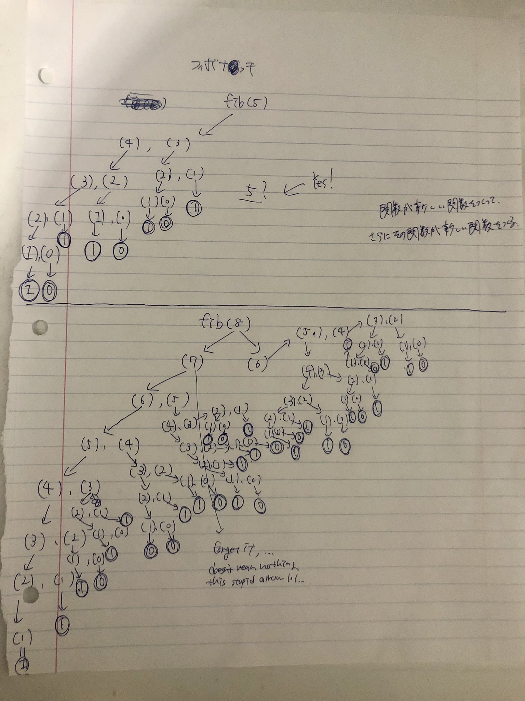

# 関数が呼び出された時に、コンピュータはどのような処理を行っているのか。

## stack

関数が呼び出される
↓
OS によって、一時的に'call stack'と呼ばれる場所に格納される。
'call stack'は stack という構造によって管理されている。

- 'stack'の構造

push 棚に入れる
pop 棚から取り出す

ex,野菜が入荷した順に棚に並べるイメージ。賞味期限がまだ先のものが、先頭にある。賞味期限が近いもの(最初の方に push された野菜)を取得するには、その手前にある野菜全てを pop する必要がある。

> このように要素が入ったきた順に並べ、末尾にある最も新しい要素から順に取り出す管理方法からスタックは、LIFO（Last In First Out）と呼ばれることもあります。
> https://recursionist.io/dashboard/course/2/lesson/136

```javascript
function subtract(x, y) {
  const myResult = x - y;
  return myResult;
}

function powerFunc(base, power) {
  return base ** power;
}

subtract(4, 10) * 20 * powerFunc(2, 5);
```

> まずはじめに、subtract(4,10) の呼び出しが、コールスタックに push され、そこでは myResult の作成と計算が行われます。関数の計算が終了すると、subtract（4,10）はコールスタックから pop され、呼び出しの中にある myResult や仮引数の中にあるデータを含めた全てのものは破壊され、-6 が返されます。

> つづいて、コンピュータは次に優先順位の高い、powerFunc（2,5）を実行します。powerFunc（2,5）の呼び出しは、同様にコールスタックに push され、関数の計算が終了すると、pop され、32 を返します。その後、式は -6 _ 20 _ 32 になり、-6 _ 20 _ 32 = -120 \* 32 = -3840 を返します。
> https://recursionist.io/dashboard/course/2/lesson/136

優先度の高いものから呼ばれて、計算が終了すると、pop されてその関数が破壊される。

## call stack(再帰関数の処理)

## フィボナッチ数列

再帰のプログラム内で再帰をしている感じかな？？

```javascript
// n 番目のフィボナッチ数を返します。
function fibonacciNumber(n) {
  // ベースケース
  if (n == 0) {
    return 0;
  } else if (n == 1) {
    return 1;
  }

  //f(4)だとしたら、まず3,2と出て、3が3-1,3-2を実行.最後に1が返ってくる
  //次に2. 2-1,2-2で0が返ってくる。
  //3+1
  return fibonacciNumber(n - 1) + fibonacciNumber(n - 2);
  //4
  //右側でずっと計算をするから、ずっと-1
  //3. 3-1,2-1,1が返ってくる。
  //左側　2.
}
fib(4);
fib(3) +
  fib(2)(fib(2) + fib(1)) +
  fib(2)(fib(1) + f(0) + fib(1)) +
  fib(2)(1 + 0 + fib(1)) +
  fib(2)(1 + fib(1)) +
  fib(2)(1 + 1) +
  fib(2);
2 + fib(2);
2 + (fib(1) + fib(0));
2 + (1 + fib(0));
2 + (1 + 0);
2 + 1;
3;
```



## 計算量(complexity)

- ある処理を行うときに、どれくらいの手間を要したかを数値で表したもの。
- 時間的(手順の回数)、空間的の 2 種類がある。(メモリの容量加減)

フェボナッチは確実に時間的計算量に無駄がある。

- O 記法で、大体の計算量を把握することができる。(Bachmann-Landau O-notation)

> n が大きくなった時、O(2n)は一瞬で何十桁にもなり、最速のコンピュータを使っても何百年もかかってしまいますが、O(logn)は n がとてつもなく大きくなっても、わずかの計算回数で済みます。このようにアルゴリズムの複雑さによって、途方もない計算量の (2n)になる可能性もあれば、非常に少ない計算量の O(logn)になる可能性もあります。コンピュータに物理制限があるため、アルゴリズムを実装する際は、時間計算量、空間計算量を意識しながら最適化されたコードを書くことが非常に重要になります。

https://recursionist.io/dashboard/course/2/lesson/142
